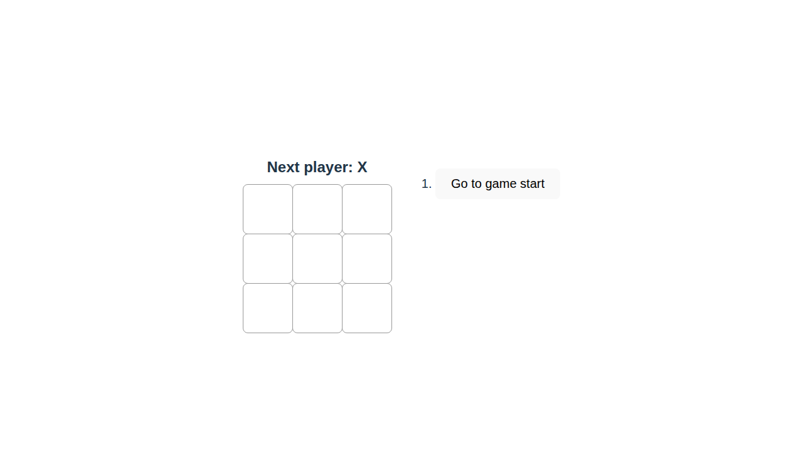
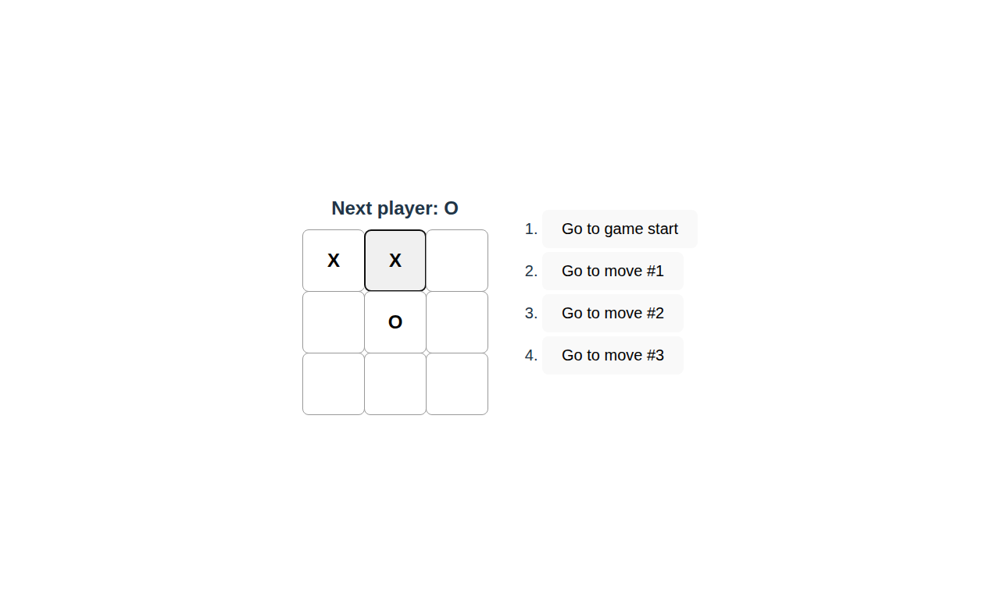
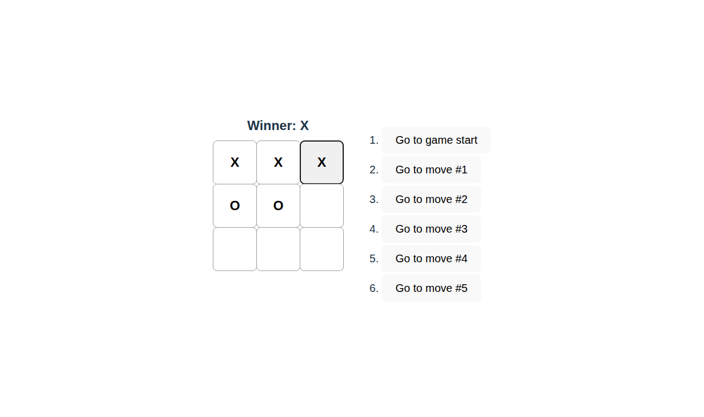

# Tic Tac Toe React App with Playwright Tests

A fully functional Tic Tac Toe game built with React and tested using Playwright.

## Features

- **Interactive Gameplay**: Click on squares to make moves
- **Turn Tracking**: Displays whose turn it is (X or O)
- **Winner Detection**: Automatically detects when a player wins
- **Draw Detection**: Recognizes when the game ends in a draw
- **Game History**: Travel back to any previous move
- **Time Travel**: Review and replay the game from any point

## Tech Stack

- **React 19.2.0**: For building the interactive UI
- **Vite 7.2.4**: Fast build tool and dev server
- **Playwright**: End-to-end testing framework
- **ESLint**: Code linting

## Getting Started

### Prerequisites

- Node.js (v20 or higher recommended)
- npm

### Installation

```bash
npm install
```

### Development

Start the development server:

```bash
npm run dev
```

The app will be available at `http://localhost:5173`

### Building

Build for production:

```bash
npm run build
```

### Testing

Run Playwright tests:

```bash
npm test
```

Run tests in UI mode:

```bash
npm run test:ui
```

Run tests in headed mode (with browser visible):

```bash
npm run test:headed
```

### Linting

```bash
npm run lint
```

## Project Structure

```
.
├── src/
│   ├── App.jsx          # Main Tic Tac Toe component
│   ├── App.css          # Styles for the game
│   ├── main.jsx         # App entry point
│   └── index.css        # Global styles
├── tests/
│   └── tictactoe.spec.js # Playwright test suite
├── screenshots/          # Screenshots from Playwright tests
│   ├── tic-tac-toe-initial.png
│   ├── tic-tac-toe-in-progress.png
│   └── tic-tac-toe-winner.png
├── playwright.config.js  # Playwright configuration
└── package.json         # Project dependencies and scripts
```

## Test Coverage

The test suite includes:
- Initial board display verification
- Player move functionality
- Winner detection (horizontal, vertical, diagonal)
- Draw detection
- Game history and time travel features
- Screenshot capture for different game states

## Screenshots

### Initial State


### Game in Progress


### Winner State


## License

This project is open source and available for educational purposes.
